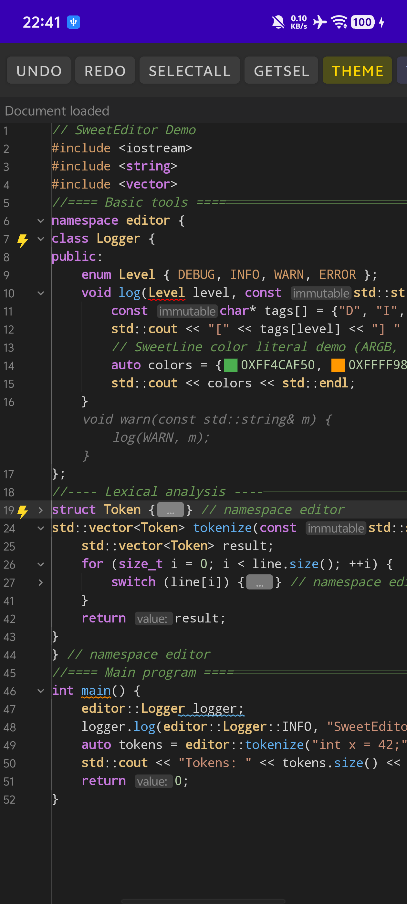
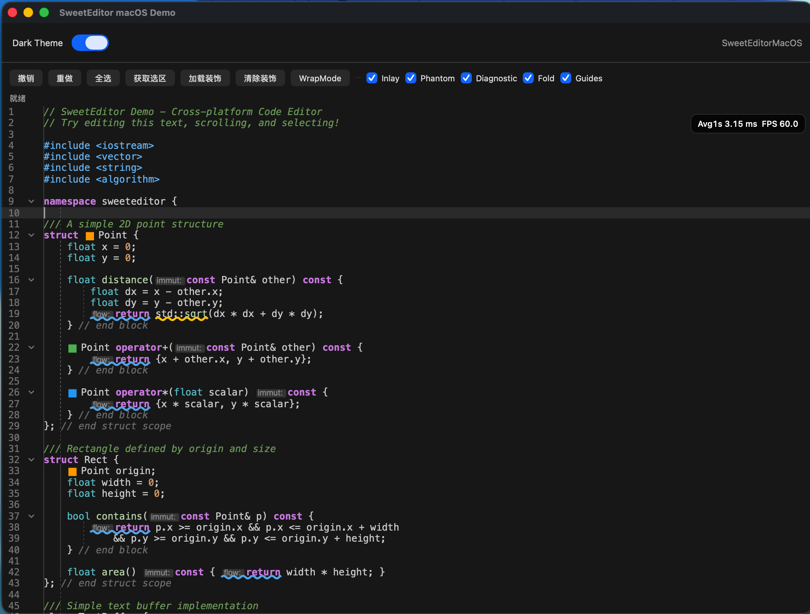
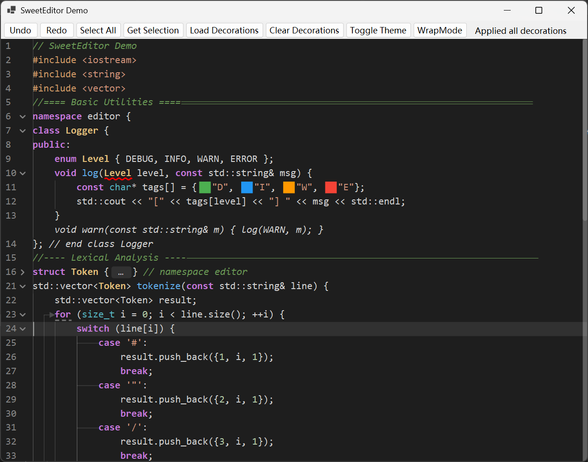
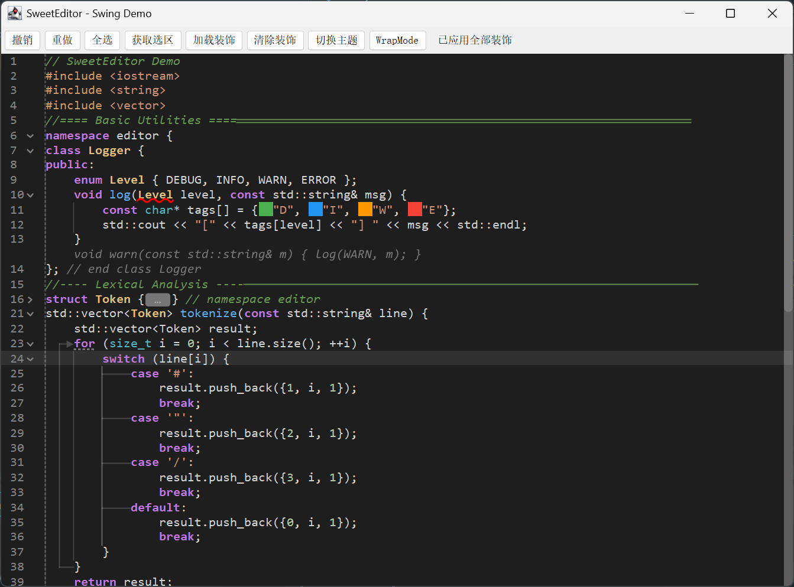

<div align="center">

**简体中文** | [English](README.md)

# SweetEditor

### 跨平台代码编辑器内核（C++17）

**C++17 内核 + 平台原生渲染，面向 IDE、AI 编程工具、云开发工作台等长期演进的编辑基础设施场景。**

[](https://isocpp.org/)
[](#实现状态)
[](LICENSE)

**Android · iOS · macOS · Windows · Swing · OHOS · Flutter · Avalonia · Web**

</div>

---

## 项目定位

SweetEditor 是一套跨平台代码编辑器内核，面向需要在不同平台保持一致编辑行为的产品。

采用“**C++17 内核 + 平台原生渲染**”架构：C++ 内核负责文档编辑语义、文本布局与装饰模型，各接入层负责输入转发与绘制。

适合用于 IDE、AI 编程工具、云开发工作台等需要长期演进的编辑基础设施场景。

## 核心特性

- **统一内核，多平台复用**：高亮、折叠、Inlay Hints、Ghost Text、结构线等能力由单一 C++ 内核统一生成
- **核心与渲染分离**：接入层聚焦输入桥接与原生绘制，降低不同目标之间的回归和维护成本
- **高级编辑能力完整**：支持代码折叠、Snippet、Linked Editing、诊断装饰、补全扩展等能力
- **性能路径明确**：基于 Piece Table、增量布局、视口渲染、SIMD Unicode 加速与 mmap 大文件加载
- **接入友好**：支持 Android、Apple 平台、Windows、Swing、OHOS、Flutter、Avalonia 和 Web

## 实现状态

| 目标                    | 状态       | 渲染技术                    | UI 框架                  | 实现来源                                                                                                              |
|-----------------------|----------|-------------------------|------------------------|-------------------------------------------------------------------------------------------------------------------|
| Android               | 已实现      | Canvas + Paint          | Android View           | [Android README](./platform/Android/sweeteditor/README.md)                                                         |
| iOS                   | 已实现      | CoreText + CoreGraphics | UIKit / SwiftUI（正在完善）  | [Apple README](./platform/Apple/README.md)                                                                         |
| macOS                 | 已实现      | CoreText + CoreGraphics | AppKit / SwiftUI（正在完善） | [Apple README](./platform/Apple/README.md)                                                                         |
| Windows               | 已实现      | GDI+                    | WinForms               | [WinForms README](./platform/WinForms/SweetEditor/README.md)                                                       |
| Swing                 | 已实现      | Java2D                  | Swing                  | [Swing README](./platform/Swing/sweeteditor/README.md)                                                             |
| OHOS                  | 已实现      | ArkUI Canvas            | ArkUI                  | [OHOS README](./platform/OHOS/sweeteditor/README.md)                                                               |
| Flutter               | 已实现      | TextPainter             | Flutter                | [Flutter README](./platform/Flutter/sweeteditor/README.md)                                                         |
| Avalonia              | 已实现      | DrawingContext          | Avalonia               | [Avalonia README](./platform/Avalonia/SweetEditor/README.md)                                                       |
| Qt                    | 已实现      | QPainter                | Qt                     | [FinalScave/SweetEditor-Qt](https://github.com/FinalScave/SweetEditor-Qt)                                         |
| Compose Multiplatform | 进行中      | Compose Canvas          | Compose                | [lumkit/SweetEditor-Compose](https://github.com/lumkit/SweetEditor-Compose)                                       |
| Web                   | 核心绑定已实现  | WebAssembly             | -                      | [Web README](./platform/Emscripten/README.md)                                                                      |
| C# WinUI              | 待实现      | -                       | -                      | -                                                                                                                 |

## 整体架构

```text
+-----------------------------------------------------------------------------------+
| Android | Apple | Swing | WinForms | OHOS | Flutter | Avalonia | Web             |
| 输入 / 绘制 / 原生资源 / 生命周期                                                   |
+-----------------------------------------------------------------------------------+
                                         |
                                         v
+-----------------------------------------------------------------------------------+
| SweetEditor Core (C++17)                                                          |
| 文档 / 编辑 / 布局 / 装饰 / 交互 / 撤销重做                                          |
+-----------------------------------------------------------------------------------+
```

> 完整架构文档请参阅 [架构设计文档](docs/zh/architecture.md)

## 核心能力

C++ 内核涵盖文档编辑（Piece Table、撤销重做、大文件加载）、文本布局（自动换行、增量布局、视口裁剪）、样式与装饰（语法/语义高亮、Inlay Hints、Ghost Text、诊断、结构线）、高级编辑（代码折叠、Snippet、Linked Editing）以及平台扩展机制（DecorationProvider、CompletionProvider）。性能基于 SIMD Unicode 转码、测量缓存与视口级渲染构建。

完整能力清单见：[EditorCore API（中文）](docs/zh/api-editor-core.md)。

## 快速开始

### 构建

```bash
git clone https://github.com/FinalScave/SweetEditor.git
cd SweetEditor
mkdir build && cd build
cmake .. -DCMAKE_BUILD_TYPE=Release
cmake --build . -j
```

快速接入请先阅读下方各实现 README；桥接层和控件层的完整 API 请参阅 [接入 API 索引](docs/zh/api-platform.md)。

### 最小集成示例

```java
SweetEditor editor = new SweetEditor(context);
editor.applyTheme(EditorTheme.dark());
editor.loadDocument(new Document("Hello, SweetEditor!"));
```

更多示例请参阅接入 API 文档。

## Demo 截图

<div align="center">
  <table>
    <tr>
      <td align="center"><b>Android</b><br/></td>
      <td align="center"><b>macOS</b><br/></td>
    </tr>
    <tr>
      <td align="center"><b>Windows (WinForms)</b><br/></td>
      <td align="center"><b>Swing</b><br/></td>
    </tr>
  </table>
</div>

> Android 原始截图分辨率较小，因此这里采用较小展示宽度。

## 依赖

SweetEditor 坚持最小依赖原则，核心运行时仅依赖少量轻量库：

- [simdutf](https://github.com/simdutf/simdutf)：SIMD 加速 Unicode 编解码
- [nlohmann/json](https://github.com/nlohmann/json)：JSON 调试导出与内部辅助结构
- [utfcpp](https://github.com/nemtrif/utfcpp)：UTF-8 迭代与校验

测试使用 [Catch2](https://github.com/catchorg/Catch2)。

## 文档

| 文档 | 说明 |
| --- | --- |
| [架构设计](docs/zh/architecture.md) | 核心架构、模块设计、数据流、渲染流水线 |
| [EditorCore API（中文）](docs/zh/api-editor-core.md) | C++ 核心层和 C API 参考 |
| [接入 API 索引（中文）](docs/zh/api-platform.md) | 所有接入 API 文档入口 |
| [接入实现标准](docs/zh/platform-implementation-standard.md) | 所有接入实现必须遵循的类型清单、模块结构、API 契约与合规规则 |
| [参与共建](docs/zh/join.md) | 仓库结构、阅读入口、平台同步检查点 |

### 接入指南

| 目标 | 指南 |
| --- | --- |
| Android | [Android README](platform/Android/sweeteditor/README.md) |
| Apple | [Apple README](platform/Apple/README.md) |
| Avalonia | [Avalonia README](platform/Avalonia/SweetEditor/README.md) |
| Flutter | [Flutter README](platform/Flutter/sweeteditor/README.md) |
| OHOS | [OHOS README](platform/OHOS/sweeteditor/README.md) |
| Swing | [Swing README](platform/Swing/sweeteditor/README.md) |
| WinForms | [WinForms README](platform/WinForms/SweetEditor/README.md) |
| Web | [Web README](platform/Emscripten/README.md) |

## 参与共建

SweetEditor 正在构建开放的跨平台编辑器基础设施生态，欢迎参与共建。

详见 [参与共建指南](docs/zh/join.md)。

## Community

<table width="100%">
  <tr>
    <td width="33%" valign="top" align="center">
      <strong>QQ</strong><br><br>
      
      <p>QQ群号：1090609035</p>
    </td>
    <td width="33%" valign="top" align="center">
      <strong>微信</strong><br><br>
      
    </td>
    <td width="33%" valign="top" align="center">
      <strong>Discord</strong><br><br>
      <a href="https://discord.gg/q5u4tGMgKQ" target="_blank">加入 Discord</a>
    </td>
  </tr>
</table>

## License

SweetEditor 采用 [MIT License](LICENSE) 授权。
